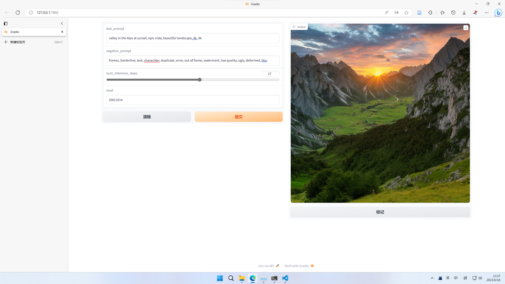
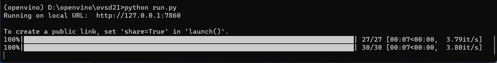

# OpenVINO based Stable Diffusion 2.1 on Intel ARC platform

A simple and easy-to-use demo to run Stable Diffusion 2.1 for Intel ARC graphics card based on OpenVINO.

This project is adapted from <https://github.com/openvinotoolkit/openvino_notebooks/tree/main/notebooks/236-stable-diffusion-v2>

## This project includes the following content

1. Converting the Stable Diffusion 2.1 model to the OpenVINO model
2. Running Stable Diffusion 2.1 on Intel ARC graphics card based on OpenVINO

## How to use

### 1. Clone the project

```CMD
git clone https://github.com/jfsunx/OVSD21  # clone
cd OVSD21
pip install -r requirements.txt  # install
```

### 2. Converting the Stable Diffusion 2.1 model to the OpenVINO model

- Open ```get_model_sd21.ipynb```, Follow the tutorial to run all codes.
- After running, the ```sd2.1``` folder will be generated in the root directory, which contains the OpenVINO model (required) and the onnx model (not used).

### 3. Run it in CMD

```cmd
python run.py
```

After loading the model into the GPU, open the browser on ```http//localhost:7860```(URL will be found in CMD)

## Examples

### GUI



### Speed on Intel ARC 770



## Acknowledgements

📚 Jupyter notebook tutorials for OpenVINO™ - <https://github.com/openvinotoolkit/openvino_notebooks>

🤗 Diffusers - <https://github.com/huggingface/diffusers>

## License

Apache 2.0
